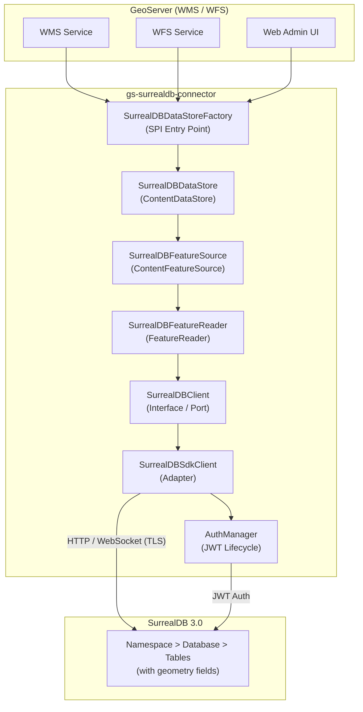
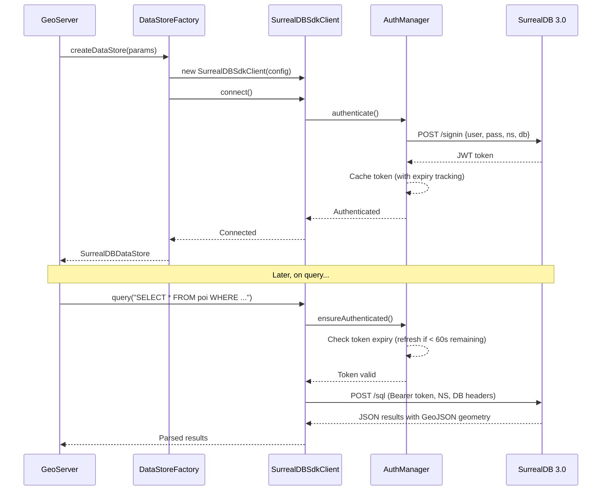

# GeoServer-SurrealDB Connector

A custom GeoServer DataStore plugin (Java) that connects GeoServer to SurrealDB 3.0, enabling geometry data stored in SurrealDB to be served as OGC-compliant WMS/WFS layers. The connector translates OGC filter queries into SurrealQL and converts SurrealDB's GeoJSON responses into JTS Geometry objects.

## Architecture



## Connection Flow



## Quick Start

### Prerequisites

- Java 17+
- Maven 3.9+
- Docker & Docker Compose

### Build

```bash
mvn clean package
```

### Start SurrealDB

```bash
docker-compose up -d surrealdb
```

### Initialize Test Data

```bash
bash docker/init-surreal.sh
```

### Run Tests

```bash
mvn test
```

### Deploy to GeoServer

```bash
# Start both SurrealDB and GeoServer
docker-compose up -d

# The plugin JAR is automatically mounted into GeoServer's WEB-INF/lib
# Access GeoServer at http://localhost:8080/geoserver
```

## Phase Status

| Phase | Description | Status |
|-------|-------------|--------|
| 1 | Foundation -- Maven scaffolding, DataStoreFactory, SurrealDBClient, JWT auth, unit tests | Complete |
| 2 | Schema & Type Mapping -- SchemaDiscovery, GeometryFieldDetector, GeoJSON-to-JTS converter | Complete |
| 3 | Feature Reading & Filters -- FeatureSource, FeatureReader, FilterTranslator (BBOX, spatial, property) | Planned |
| 4 | GeoServer Integration -- Deploy JAR, Web Admin, WMS GetMap, WFS GetFeature, profiling | Planned |
| 5 | Hardening -- Connection pooling, caching, TLS, error handling, logging, load testing | Planned |
| 6 | Write Support (Optional) -- WFS-T INSERT/UPDATE/DELETE, transaction management | Planned |

## Project Structure

```
geoserver-surrealdb-connector/
├── pom.xml
├── docker-compose.yml
├── docker/
│   └── init-surreal.sh
├── src/
│   ├── main/
│   │   ├── java/org/geotools/data/surrealdb/
│   │   │   ├── SurrealDBDataStoreFactory.java
│   │   │   ├── SurrealDBDataStore.java
│   │   │   ├── SurrealDBFeatureSource.java
│   │   │   ├── SurrealDBFeatureReader.java
│   │   │   ├── client/
│   │   │   │   ├── SurrealDBClient.java
│   │   │   │   ├── SurrealDBSdkClient.java
│   │   │   │   ├── ConnectionConfig.java
│   │   │   │   └── AuthManager.java
│   │   │   ├── config/
│   │   │   │   └── SurrealDBDataStoreParams.java
│   │   │   ├── filter/
│   │   │   │   └── SurrealDBFilterTranslator.java
│   │   │   ├── schema/
│   │   │   │   ├── SchemaDiscovery.java
│   │   │   │   ├── GeometryFieldDetector.java
│   │   │   │   ├── FeatureTypeMapper.java
│   │   │   │   ├── FieldSchema.java
│   │   │   │   └── TableSchema.java
│   │   │   └── geometry/
│   │   │       └── GeoJsonToJtsConverter.java
│   │   └── resources/
│   │       └── META-INF/services/
│   │           └── org.geotools.api.data.DataStoreFactorySpi
│   └── test/
│       └── java/org/geotools/data/surrealdb/
│           ├── SurrealDBDataStoreFactoryTest.java
│           ├── SurrealDBDataStoreTest.java
│           ├── client/
│           │   ├── AuthManagerTest.java
│           │   ├── ConnectionConfigTest.java
│           │   └── SurrealDBSdkClientTest.java
│           ├── config/
│           │   └── SurrealDBDataStoreParamsTest.java
│           ├── schema/
│           │   ├── FieldSchemaTest.java
│           │   ├── TableSchemaTest.java
│           │   ├── GeometryFieldDetectorTest.java
│           │   ├── SchemaDiscoveryTest.java
│           │   └── FeatureTypeMapperTest.java
│           └── geometry/
│               └── GeoJsonToJtsConverterTest.java
├── ARCHITECTURE.md
├── CLAUDE.md
└── README.md
```

## Technology Stack

| Component | Technology | Version |
|-----------|-----------|---------|
| Language | Java | 17+ |
| Build System | Maven | 3.9+ |
| GeoTools | gt-main, gt-api | 34.1 |
| Database | SurrealDB | 3.0 (Java SDK 1.0.0-beta.1) |
| Geometry | JTS Core (LocationTech) | via GeoTools |
| JSON | Gson | 2.11.0 |
| HTTP Client | OkHttp (fallback) | 4.12.0 |
| Logging | SLF4J | via GeoTools |
| Testing | JUnit 5 | 5.10+ |
| Mocking | Mockito | 5.x |
| Integration Testing | Testcontainers | 1.19.0 |
| Containerization | Docker & Docker Compose | - |
| OGC Standards | WMS 1.3.0, WFS 2.0 | - |

## License

This project is licensed under the [Apache License 2.0](https://www.apache.org/licenses/LICENSE-2.0).
