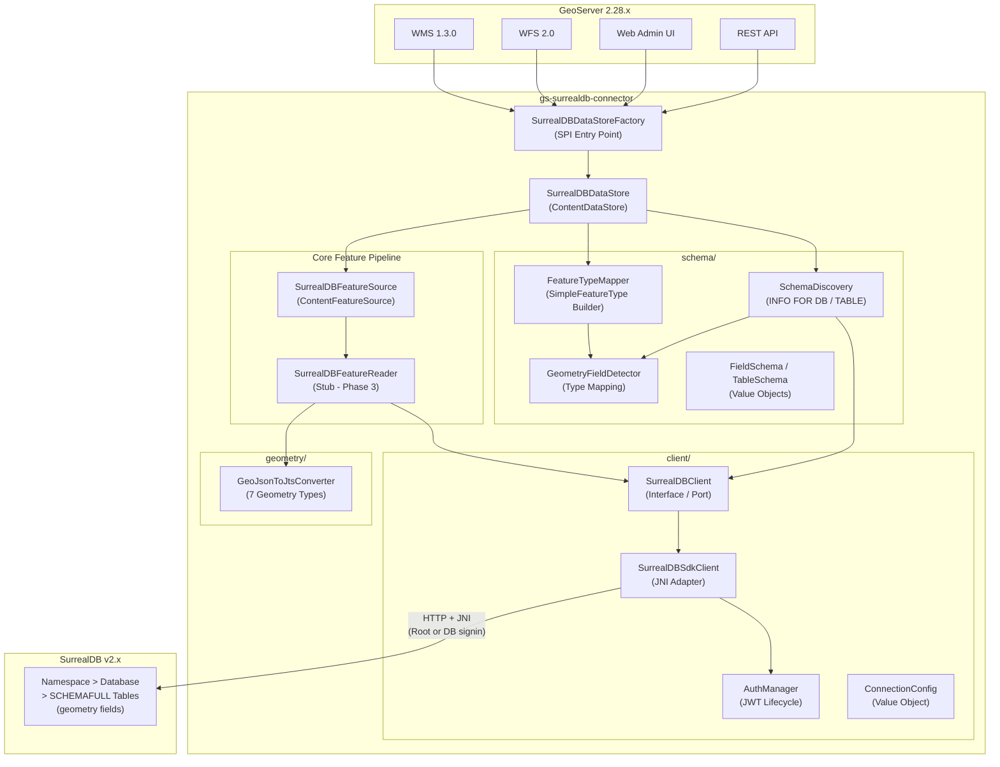
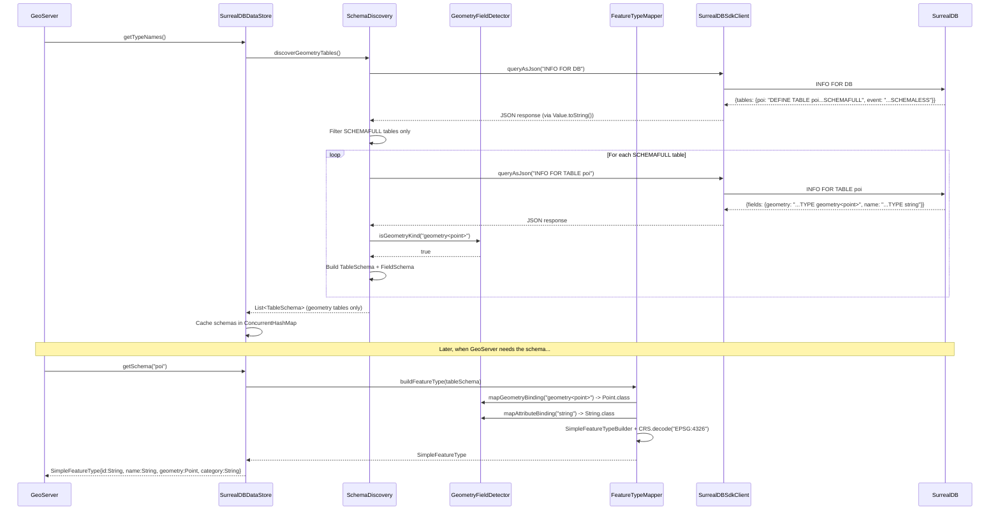
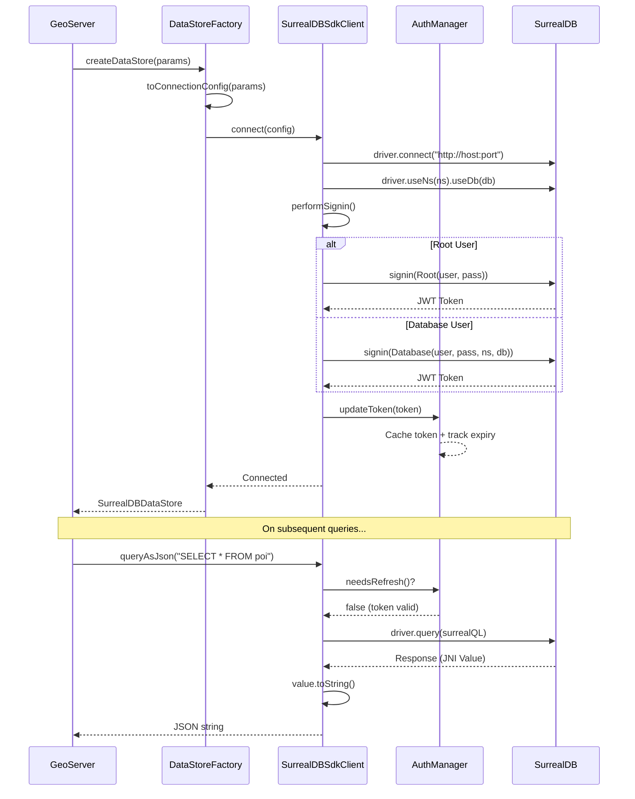
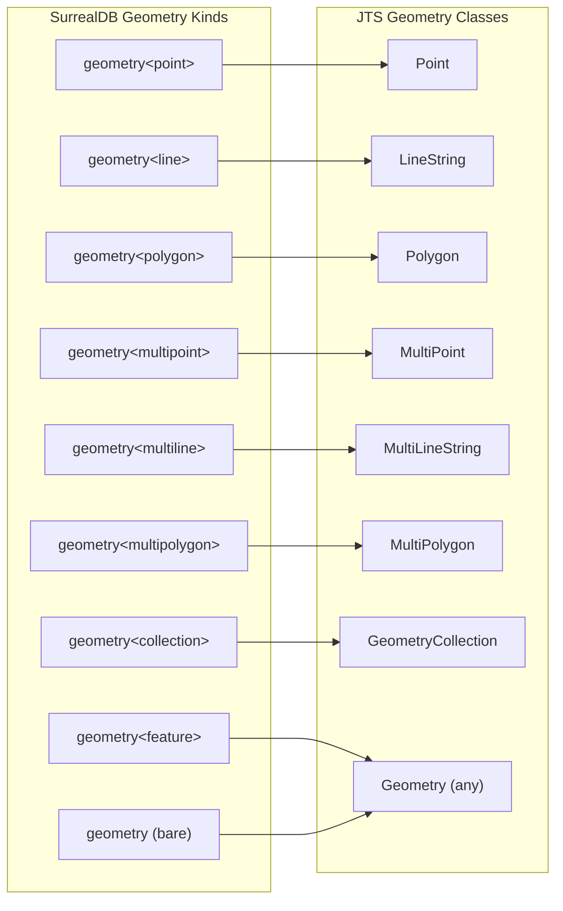
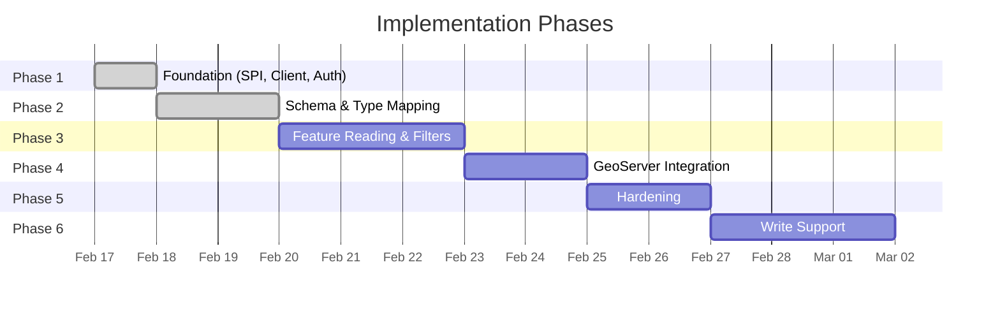

# GeoServer-SurrealDB Connector

A custom GeoServer DataStore plugin (Java) that connects GeoServer to SurrealDB, enabling geometry data stored in SurrealDB to be served as OGC-compliant WMS/WFS layers. The connector introspects SurrealDB schemas, maps SurrealDB types to JTS geometry classes, and converts GeoJSON responses into JTS Geometry objects.

## Architecture



## Schema Discovery Flow



## Connection & Authentication Flow



## Type Mapping

### SurrealDB Geometry Types to JTS



### SurrealDB Attribute Types to Java

| SurrealDB Kind | Java Class |
|----------------|------------|
| `string` | `String` |
| `int` | `Long` |
| `float` | `Double` |
| `number` | `Double` |
| `bool` | `Boolean` |
| `datetime` | `java.util.Date` |
| `decimal` | `BigDecimal` |
| `duration` | `String` |
| `object` / `record` / `array` | `String` (JSON) |

## Quick Start

### Prerequisites

- Java 17+ (build/test with Java 21 recommended)
- Maven 3.9+
- Docker & Docker Compose

### Build

```bash
# Use Java 21 for building (required for Mockito compatibility)
JAVA_HOME=/opt/homebrew/opt/openjdk@21 mvn clean package
```

### Run Tests

```bash
JAVA_HOME=/opt/homebrew/opt/openjdk@21 mvn test
# 122 tests across 12 test classes
```

### Deploy to GeoServer

```bash
# Start SurrealDB + GeoServer (plugin JAR auto-mounted)
docker compose up -d

# Initialize sample spatial data
bash docker/init-surreal.sh

# Access GeoServer at http://localhost:8080/geoserver
# Login: admin / geoserver
```

### Configure SurrealDB Data Store

1. Navigate to **Data > Stores > Add new Store**
2. Select **SurrealDB** under Vector Data Sources
3. Fill in connection parameters:

| Parameter | Description | Default |
|-----------|-------------|---------|
| `host` | SurrealDB hostname | `localhost` |
| `port` | SurrealDB port | `8000` |
| `surreal_ns` | SurrealDB namespace | *(required)* |
| `database` | SurrealDB database | *(required)* |
| `user` | Username (root or DB user) | *(required)* |
| `password` | Password | *(required)* |
| `use_tls` | Enable TLS encryption | `false` |
| `protocol` | Connection protocol | `http` |
| `pool_size` | Connection pool size | `5` |
| `timeout` | Connection timeout (ms) | `30000` |
| `geometry_field` | Default geometry field | `geometry` |
| `srid` | Default SRID | `4326` |

4. Click **Save** -- GeoServer auto-discovers SCHEMAFULL tables with geometry fields
5. Navigate to **Data > Layers > Add new Layer**, select the SurrealDB store, and publish layers

### Sample Data (Docker)

The `docker/init-surreal.sh` script creates sample tables in namespace `geoserver`, database `spatial`:

| Table | Type | Geometry | Records |
|-------|------|----------|---------|
| `poi` | SCHEMAFULL | `geometry<point>` | 3 (Central Park, Times Square, Brooklyn Bridge) |
| `park` | SCHEMAFULL | `geometry<polygon>` | 2 (Central Park, Bryant Park) |
| `trail` | SCHEMAFULL | `geometry<line>` | 1 (Hudson River Greenway) |
| `event` | SCHEMALESS | *(excluded)* | 1 (not discovered by connector) |

## Phase Status

| Phase | Description | Status | Tests |
|-------|-------------|--------|-------|
| 1 | Foundation -- Maven scaffolding, DataStoreFactory, SurrealDBClient, JWT auth | Complete | 43 |
| 2 | Schema & Type Mapping -- SchemaDiscovery, GeometryFieldDetector, GeoJSON-to-JTS, GeoServer deployment | Complete | 122 |
| 3 | Feature Reading & Filters -- FeatureReader, FilterTranslator (BBOX, spatial, property), bounds/count | Planned | - |
| 4 | GeoServer Integration -- WMS GetMap, WFS GetFeature, performance profiling | Planned | - |
| 5 | Hardening -- Connection pooling, caching, TLS, error handling, logging, load testing | Planned | - |
| 6 | Write Support (Optional) -- WFS-T INSERT/UPDATE/DELETE, transaction management | Planned | - |



## Project Structure

```
geoserver-surrealdb-connector/
├── pom.xml                          # Maven build (GeoTools 34.1, SurrealDB SDK)
├── docker-compose.yml               # SurrealDB v2.2.1 + GeoServer 2.28.0
├── docker/
│   └── init-surreal.sh              # Sample spatial data (poi, park, trail, event)
├── src/
│   ├── main/
│   │   ├── java/org/geotools/data/surrealdb/
│   │   │   ├── SurrealDBDataStoreFactory.java   # SPI entry point
│   │   │   ├── SurrealDBDataStore.java          # ContentDataStore (table discovery)
│   │   │   ├── SurrealDBFeatureSource.java      # ContentFeatureSource (schema)
│   │   │   ├── SurrealDBFeatureReader.java      # FeatureReader (stub)
│   │   │   ├── client/
│   │   │   │   ├── SurrealDBClient.java         # Interface (Port)
│   │   │   │   ├── SurrealDBSdkClient.java      # JNI adapter (Root/DB signin)
│   │   │   │   ├── ConnectionConfig.java        # Immutable config value object
│   │   │   │   └── AuthManager.java             # JWT token lifecycle
│   │   │   ├── config/
│   │   │   │   └── SurrealDBDataStoreParams.java  # GeoServer param definitions
│   │   │   ├── schema/
│   │   │   │   ├── SchemaDiscovery.java         # INFO FOR DB/TABLE parsing
│   │   │   │   ├── GeometryFieldDetector.java   # SurrealDB kind -> JTS class
│   │   │   │   ├── FeatureTypeMapper.java       # TableSchema -> SimpleFeatureType
│   │   │   │   ├── FieldSchema.java             # Field value object
│   │   │   │   └── TableSchema.java             # Table value object
│   │   │   └── geometry/
│   │   │       └── GeoJsonToJtsConverter.java   # GeoJSON -> JTS (7 types)
│   │   └── resources/META-INF/services/
│   │       └── org.geotools.api.data.DataStoreFactorySpi
│   └── test/java/org/geotools/data/surrealdb/
│       ├── SurrealDBDataStoreFactoryTest.java   # 8 tests
│       ├── SurrealDBDataStoreTest.java          # 5 tests
│       ├── client/
│       │   ├── AuthManagerTest.java             # 12 tests
│       │   ├── ConnectionConfigTest.java        # 12 tests
│       │   └── SurrealDBSdkClientTest.java      # 8 tests
│       ├── config/
│       │   └── SurrealDBDataStoreParamsTest.java  # 3 tests
│       ├── schema/
│       │   ├── FieldSchemaTest.java             # 7 tests
│       │   ├── TableSchemaTest.java             # 11 tests
│       │   ├── GeometryFieldDetectorTest.java   # 31 tests
│       │   ├── SchemaDiscoveryTest.java         # 8 tests
│       │   └── FeatureTypeMapperTest.java       # 5 tests
│       └── geometry/
│           └── GeoJsonToJtsConverterTest.java   # 12 tests
├── ARCHITECTURE.md
├── CLAUDE.md
└── README.md
```

## Technology Stack

| Component | Technology | Version |
|-----------|-----------|---------|
| Language | Java | 17+ (build with 21) |
| Build System | Maven | 3.9+ |
| GeoTools | gt-main, gt-api | 34.1 |
| Database | SurrealDB | v2.2.1 (Java SDK 1.0.0-beta.1) |
| Geometry | JTS Core (LocationTech) | via GeoTools |
| JSON | Gson | 2.11.0 |
| HTTP Client | OkHttp (fallback) | 4.12.0 |
| Logging | SLF4J | via GeoTools |
| Testing | JUnit 5 + Mockito | 5.10+ / 5.15+ |
| Containerization | Docker Compose | - |
| OGC Standards | WMS 1.3.0, WFS 2.0 | - |

## Key Design Decisions

| Decision | Rationale |
|----------|-----------|
| **`Value.toString()` over Gson serialization** | SDK's `Value` extends `Native` (JNI). `Gson.toJson(value)` serializes the pointer field `{"ptr":123}`, not the data. `Value.toString()` calls the native method returning the actual content. |
| **Root-then-Database signin** | `performSignin()` tries `Root` credential first, falls back to `Database`. Server root users can't authenticate with `Database`-scoped signin. |
| **`surreal_ns` parameter key** | GeoServer reserves `namespace` for workspace URI. Renamed to `surreal_ns` to avoid collision. |
| **Gson 2.11.0 override in Docker** | GeoServer ships `gson-2.3.1` which lacks `JsonParser.parseString()`. Docker mounts override both the old and new JAR paths. |
| **SCHEMAFULL-only discovery** | Only SCHEMAFULL tables have typed field definitions. SCHEMALESS tables return empty field lists and are excluded from discovery. |
| **ContentDataStore base class** | Provides built-in entry caching, transaction management, and the standard GeoTools feature pipeline contract. |

## License

This project is licensed under the [Apache License 2.0](https://www.apache.org/licenses/LICENSE-2.0).
