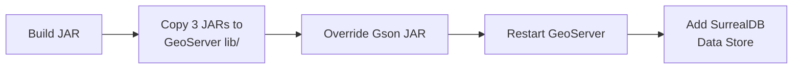
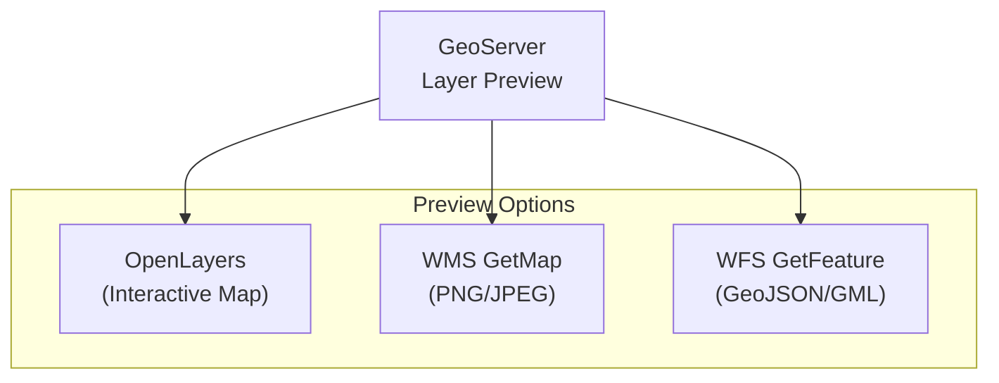
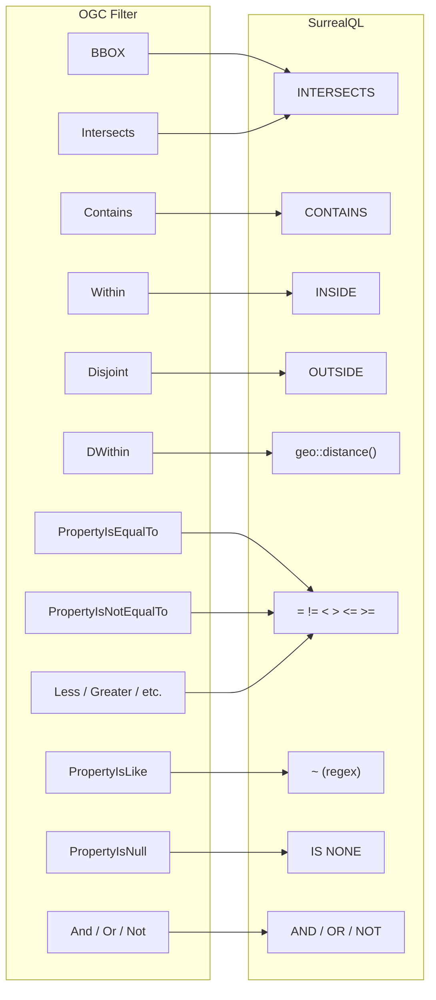
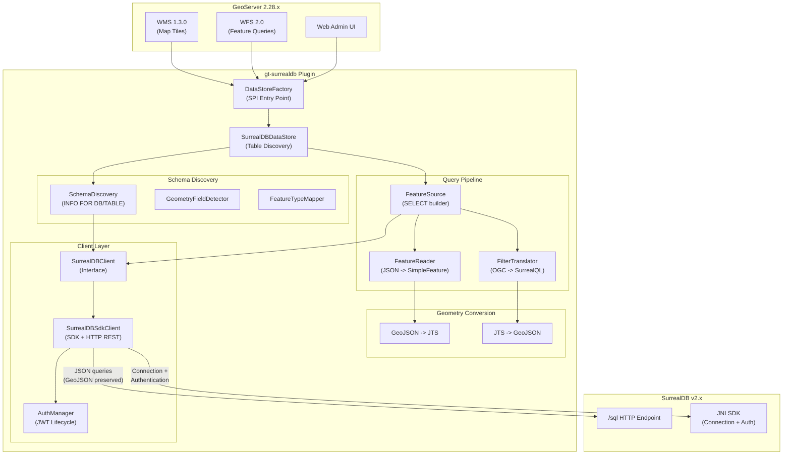
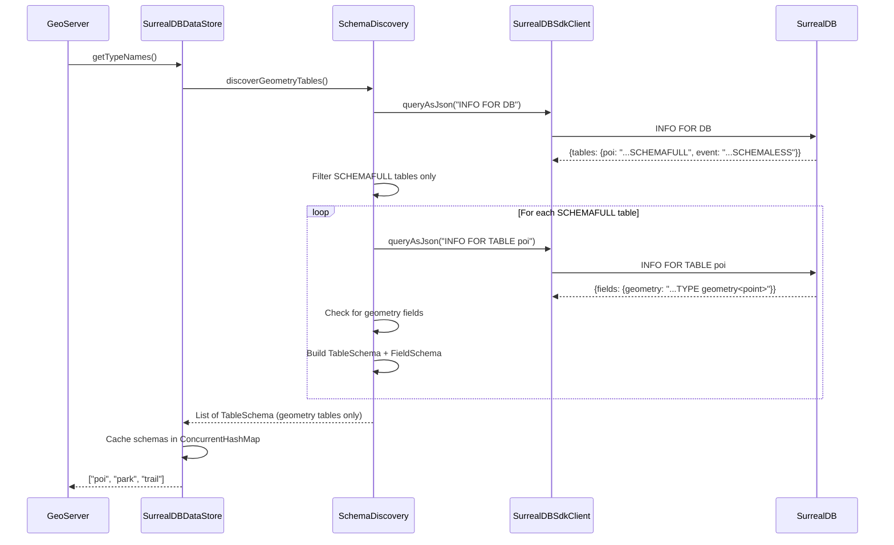
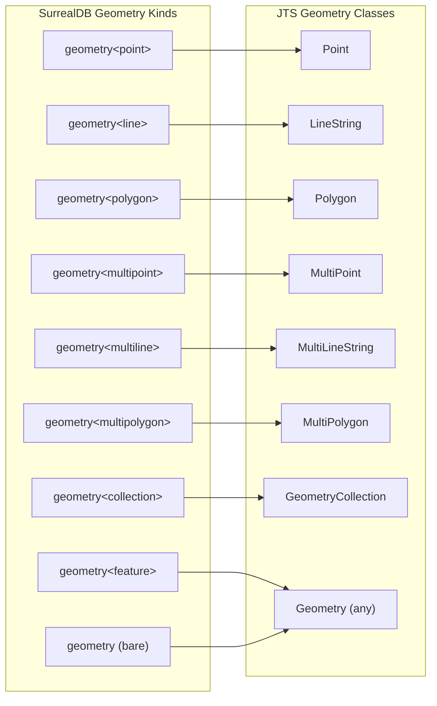

# GeoServer-SurrealDB Connector

A GeoServer DataStore plugin that connects [GeoServer](https://geoserver.org/) to [SurrealDB](https://surrealdb.com/), enabling geometry data stored in SurrealDB to be served as OGC-compliant **WMS** and **WFS** layers. The connector auto-discovers SurrealDB schemas, translates OGC filters to SurrealQL, and streams GeoJSON geometries as JTS features.

**Supported**: GeoServer 2.28.x / GeoTools 34.x / SurrealDB v2.x

## Table of Contents

- [Features](#features)
- [Installation](#installation)
  - [Option A: Docker (Quick Start)](#option-a-docker-quick-start)
  - [Option B: Add to Existing GeoServer](#option-b-add-to-existing-geoserver)
- [Configuring the Data Store](#configuring-the-data-store)
- [Publishing Layers](#publishing-layers)
- [SurrealDB Schema Requirements](#surrealdb-schema-requirements)
- [Supported OGC Filters](#supported-ogc-filters)
- [Architecture](#architecture)
- [Type Mapping](#type-mapping)
- [Building from Source](#building-from-source)
- [Troubleshooting](#troubleshooting)
- [Project Structure](#project-structure)
- [License](#license)

## Features

- Auto-discovers `SCHEMAFULL` tables with geometry fields
- Serves layers via **WMS 1.3.0** (map tiles) and **WFS 2.0** (feature queries)
- Translates OGC filters (BBOX, spatial, comparison, logical) to SurrealQL
- Supports all 7 GeoJSON geometry types (Point, LineString, Polygon, Multi*, GeometryCollection)
- Parameterized queries to prevent SurrealQL injection
- JWT authentication with automatic token refresh
- Works with both root and database-scoped SurrealDB users

## Installation

### Option A: Docker (Quick Start)

The fastest way to try the connector. Starts SurrealDB and GeoServer with the plugin pre-installed and sample spatial data loaded.

**Prerequisites**: Docker and Docker Compose

```bash
# 1. Clone the repository
git clone https://github.com/nitin84india/geoserver-surrealdb-connector.git
cd geoserver-surrealdb-connector

# 2. Build the plugin JAR (requires Java 17+ and Maven 3.9+)
JAVA_HOME=/opt/homebrew/opt/openjdk@21 mvn clean package -DskipTests

# 3. Start SurrealDB + GeoServer (plugin JAR is auto-mounted)
docker compose up -d

# 4. Wait for GeoServer to start (takes ~30 seconds)
# Check readiness:
curl -s -o /dev/null -w "%{http_code}" http://localhost:8080/geoserver/web/
# Should return 200

# 5. Initialize sample spatial data
bash docker/init-surreal.sh

# 6. Open GeoServer Web Admin
# URL: http://localhost:8080/geoserver
# Login: admin / geoserver
```

Continue to [Configuring the Data Store](#configuring-the-data-store) to add SurrealDB as a data source.

### Option B: Add to Existing GeoServer

If you already have GeoServer running (standalone or Tomcat), follow these steps to install the plugin manually.



#### Step 1: Build the Plugin

```bash
git clone https://github.com/nitin84india/geoserver-surrealdb-connector.git
cd geoserver-surrealdb-connector

# Build (requires Java 17+ and Maven 3.9+)
JAVA_HOME=/opt/homebrew/opt/openjdk@21 mvn clean package -DskipTests
```

This produces:
- `target/gt-surrealdb-1.0.0-SNAPSHOT.jar` -- the plugin
- `target/lib/surrealdb-1.0.0-beta.1.jar` -- SurrealDB Java SDK
- `target/lib/gson-2.11.0.jar` -- Gson (required override)

#### Step 2: Locate GeoServer's Library Directory

Find the `WEB-INF/lib/` directory of your GeoServer installation:

| Installation Type | Typical Path |
|-------------------|--------------|
| **Standalone (bin/)** | `<geoserver>/webapps/geoserver/WEB-INF/lib/` |
| **Tomcat WAR** | `<tomcat>/webapps/geoserver/WEB-INF/lib/` |
| **Docker (kartoza)** | `/usr/local/tomcat/webapps/geoserver/WEB-INF/lib/` |
| **Docker (oscarfonts)** | `/opt/geoserver/webapps/geoserver/WEB-INF/lib/` |

#### Step 3: Copy the JARs

Copy all three JARs into GeoServer's `WEB-INF/lib/` directory:

```bash
GEOSERVER_LIB="/path/to/geoserver/WEB-INF/lib"

# Copy the plugin JAR
cp target/gt-surrealdb-1.0.0-SNAPSHOT.jar "$GEOSERVER_LIB/"

# Copy the SurrealDB SDK JAR
cp target/lib/surrealdb-1.0.0-beta.1.jar "$GEOSERVER_LIB/"

# Copy Gson 2.11.0 (required: GeoServer ships an older version)
cp target/lib/gson-2.11.0.jar "$GEOSERVER_LIB/"
```

#### Step 4: Replace the Bundled Gson

GeoServer bundles `gson-2.3.1.jar` which is too old for this plugin. You must replace it:

```bash
# Remove the old Gson (file name may vary by GeoServer version)
rm -f "$GEOSERVER_LIB"/gson-2.*.jar

# Verify only the new Gson is present
ls "$GEOSERVER_LIB"/gson*
# Should show only: gson-2.11.0.jar
```

> **Important**: If you skip this step, the plugin will fail with `NoSuchMethodError` on `JsonParser.parseString()`.

#### Step 5: Restart GeoServer

```bash
# Standalone
cd /path/to/geoserver && bin/shutdown.sh && bin/startup.sh

# Tomcat
sudo systemctl restart tomcat

# Docker
docker restart <geoserver-container>
```

#### Step 6: Verify Installation

1. Open GeoServer Web Admin (default: `http://localhost:8080/geoserver`)
2. Go to **Data > Stores > Add new Store**
3. You should see **SurrealDB** listed under **Vector Data Sources**

If SurrealDB does not appear, check the GeoServer logs for errors (see [Troubleshooting](#troubleshooting)).

## Configuring the Data Store

Once the plugin is installed, connect GeoServer to your SurrealDB instance:

1. In the GeoServer Web Admin, navigate to **Data > Stores > Add new Store**
2. Select **SurrealDB** under Vector Data Sources
3. Choose a **Workspace** (or create one)
4. Fill in the connection parameters:

| Parameter | Description | Default | Required |
|-----------|-------------|---------|----------|
| `host` | SurrealDB hostname or IP | `localhost` | No |
| `port` | SurrealDB HTTP port | `8000` | No |
| `surreal_ns` | SurrealDB namespace | -- | Yes |
| `database` | SurrealDB database name | -- | Yes |
| `user` | Username (root or DB-scoped) | -- | Yes |
| `password` | Password | -- | Yes |
| `use_tls` | Enable TLS/HTTPS | `false` | No |
| `protocol` | Connection protocol (`http` or `ws`) | `http` | No |
| `timeout` | Connection timeout (ms) | `30000` | No |
| `geometry_field` | Default geometry field name | `geometry` | No |
| `srid` | Default spatial reference ID | `4326` | No |

> **Note**: The parameter is `surreal_ns` (not `namespace`) because GeoServer reserves `namespace` for its own workspace URI.

5. Click **Save**

The connector runs `INFO FOR DB` and `INFO FOR TABLE` to discover all `SCHEMAFULL` tables that contain at least one geometry field.

## Publishing Layers

After configuring the data store:

1. Navigate to **Data > Layers > Add a new layer**
2. Select your SurrealDB store from the dropdown
3. Click **Publish** next to the table you want to expose
4. On the Edit Layer page:
   - The **Bounding Box** fields: click **Compute from data** then **Compute from native bounds**
   - Verify the **SRS** is `EPSG:4326` (or your configured SRID)
5. Click **Save**

### Previewing Your Layers

After publishing, preview layers via GeoServer's built-in clients:



- **OpenLayers preview**: Go to **Data > Layer Preview**, find your layer, and click **OpenLayers**
- **WMS GetMap** (map image):
  ```
  http://localhost:8080/geoserver/wms?
    service=WMS&version=1.1.0&request=GetMap
    &layers=<workspace>:<table>
    &bbox=-74.1,40.6,-73.8,40.9
    &width=800&height=600
    &srs=EPSG:4326
    &format=image/png
  ```
- **WFS GetFeature** (GeoJSON):
  ```
  http://localhost:8080/geoserver/wfs?
    service=WFS&version=2.0.0&request=GetFeature
    &typeNames=<workspace>:<table>
    &outputFormat=application/json
    &count=10
  ```

## SurrealDB Schema Requirements

The connector only discovers **SCHEMAFULL** tables with typed geometry fields. Your SurrealDB tables must be defined like this:

```sql
-- Define a SCHEMAFULL table (required -- SCHEMALESS tables are ignored)
DEFINE TABLE poi SCHEMAFULL;

-- Define fields with explicit types
DEFINE FIELD name     ON poi TYPE string;
DEFINE FIELD geometry ON poi TYPE geometry<point>;
DEFINE FIELD category ON poi TYPE option<string>;
DEFINE FIELD rating   ON poi TYPE option<float>;

-- Insert data with GeoJSON geometry
CREATE poi SET
  name = "Central Park",
  geometry = {"type": "Point", "coordinates": [-73.9654, 40.7829]},
  category = "park",
  rating = 4.8;
```

**Key rules**:
- Tables must be `SCHEMAFULL` (use `DEFINE TABLE ... SCHEMAFULL`)
- At least one field must be a geometry type (e.g., `geometry<point>`, `geometry<polygon>`)
- Geometry values must be valid GeoJSON
- Nullable fields should use `option<type>` (e.g., `option<string>`)
- The connector requires a user with **root** access or a DB-scoped user with at least **EDITOR** role

### Supported Geometry Field Types

| SurrealDB Type | Geometry |
|----------------|----------|
| `geometry<point>` | Point |
| `geometry<line>` | LineString |
| `geometry<polygon>` | Polygon |
| `geometry<multipoint>` | MultiPoint |
| `geometry<multiline>` | MultiLineString |
| `geometry<multipolygon>` | MultiPolygon |
| `geometry<collection>` | GeometryCollection |
| `geometry` (bare) | Any geometry |

## Supported OGC Filters

The connector translates OGC filter expressions to SurrealQL WHERE clauses. Filters that cannot be translated are silently degraded to `INCLUDE`, letting GeoTools apply them as in-memory post-filters.



| OGC Filter | SurrealQL Translation | Example |
|------------|----------------------|---------|
| `BBOX` | `geom INTERSECTS $p0` | Bounding box converted to polygon |
| `Intersects` | `geom INTERSECTS $p0` | Geometry intersection test |
| `Contains` | `geom CONTAINS $p0` | Geometry containment test |
| `Within` | `geom INSIDE $p0` | Feature inside geometry |
| `Disjoint` | `geom OUTSIDE $p0` | Feature outside geometry |
| `DWithin` | `geo::distance(geom, $p0) < $p1` | Distance-based filter |
| `PropertyIsEqualTo` | `field = $p0` | Exact match |
| `PropertyIsNotEqualTo` | `field != $p0` | Not equal |
| `PropertyIsLessThan` | `field < $p0` | Less than |
| `PropertyIsGreaterThan` | `field > $p0` | Greater than |
| `PropertyIsLessThanOrEqualTo` | `field <= $p0` | Less than or equal |
| `PropertyIsGreaterThanOrEqualTo` | `field >= $p0` | Greater than or equal |
| `PropertyIsBetween` | `field >= $p0 AND field <= $p1` | Range check |
| `PropertyIsLike` | `field ~ $p0` | LIKE pattern converted to regex |
| `PropertyIsNull` | `field IS NONE` | Null check |
| `And` / `Or` / `Not` | `AND` / `OR` / `NOT (...)` | Logical composition |

**Unsupported filters** (Crosses, Touches, Overlaps, Beyond): Silently degraded to INCLUDE -- GeoTools applies them in-memory.

## Architecture



### Query Execution Flow

```mermaid
sequenceDiagram
    participant GS as GeoServer
    participant FS as FeatureSource
    participant FT as FilterTranslator
    participant Client as SurrealDBSdkClient
    participant DB as SurrealDB /sql

    GS->>FS: getReader(Query)
    FS->>FS: buildSelectClause(properties)
    FS->>FT: translate(OGC Filter)
    FT->>FT: BBOX -> INTERSECTS $p0
    FT-->>FS: TranslationResult{where, params}

    FS->>Client: queryBindAsJson(sql, params)
    Client->>Client: Build LET $p0 = {...}; SELECT
    Client->>DB: POST /sql (Basic Auth)
    DB-->>Client: [{result: [...], status: "OK"}]
    Client->>Client: Extract last statement result
    Client-->>FS: JSON array string

    FS->>FS: Parse JSON -> FeatureReader
    FS-->>GS: FeatureReader (streams features)
```

### Schema Discovery Flow



## Type Mapping

### SurrealDB Geometry Types to JTS



### SurrealDB Attribute Types to Java

| SurrealDB Kind | Java Class |
|----------------|------------|
| `string` | `String` |
| `int` | `Long` |
| `float` | `Double` |
| `number` | `Double` |
| `bool` | `Boolean` |
| `datetime` | `java.util.Date` |
| `decimal` | `BigDecimal` |
| `duration` | `String` |
| `object` / `record` / `array` | `String` (JSON) |

## Building from Source

### Prerequisites

- Java 17+ (Java 21 recommended for build/test)
- Maven 3.9+
- Docker (optional, for running the demo stack)

### Build

```bash
# Clone
git clone https://github.com/nitin84india/geoserver-surrealdb-connector.git
cd geoserver-surrealdb-connector

# Build (skip tests for faster build)
JAVA_HOME=/opt/homebrew/opt/openjdk@21 mvn clean package -DskipTests

# Build with tests (192 tests across 17 test classes)
JAVA_HOME=/opt/homebrew/opt/openjdk@21 mvn clean test
```

> **Linux users**: Replace the `JAVA_HOME` path with your Java 21 installation (e.g., `/usr/lib/jvm/java-21-openjdk`).

### Build Output

After `mvn package`, the following artifacts are produced:

```
target/
  gt-surrealdb-1.0.0-SNAPSHOT.jar   # Plugin JAR (deploy this)
  lib/
    surrealdb-1.0.0-beta.1.jar      # SurrealDB Java SDK
    gson-2.11.0.jar                  # Gson (Gson override)
```

### Docker Demo Stack

The included `docker-compose.yml` runs SurrealDB v2.2.1 and GeoServer 2.28.0 with the plugin auto-mounted:

```bash
# Start the stack
docker compose up -d

# Load sample data (7 POIs, 2 parks, 1 trail)
bash docker/init-surreal.sh

# Stop the stack
docker compose down
```

Sample data is loaded into namespace `geoserver`, database `spatial`:

| Table | Geometry Type | Records | Description |
|-------|--------------|---------|-------------|
| `poi` | `geometry<point>` | 7 | Points of interest (NYC, LA, SF) |
| `park` | `geometry<polygon>` | 2 | Park boundaries (Central Park, Bryant Park) |
| `trail` | `geometry<line>` | 1 | Trail path (Hudson River Greenway) |
| `event` | *(SCHEMALESS)* | 1 | Excluded from discovery by design |

## Troubleshooting

### SurrealDB does not appear as a Data Store option

- Verify the plugin JAR is in `WEB-INF/lib/`:
  ```bash
  ls $GEOSERVER_LIB/gt-surrealdb*.jar
  ```
- Check GeoServer logs for SPI loading errors:
  ```bash
  grep -i "surrealdb" /path/to/geoserver/data/logs/geoserver.log
  ```
- Restart GeoServer after adding JARs

### "NoSuchMethodError: JsonParser.parseString()" on startup

You have an old Gson version. Remove the bundled `gson-2.3.1.jar` and ensure only `gson-2.11.0.jar` is in `WEB-INF/lib/`:

```bash
rm -f "$GEOSERVER_LIB"/gson-2.3.1.jar
ls "$GEOSERVER_LIB"/gson*
# Should show: gson-2.11.0.jar
```

### "Failed to authenticate to SurrealDB"

- Verify SurrealDB is reachable from GeoServer's host:
  ```bash
  curl -s http://<surrealdb-host>:8000/health
  ```
- Check that the namespace and database exist
- For Docker Compose: use `surrealdb` as hostname (Docker service name), not `localhost`
- Root users must sign in with root credentials; DB-scoped users need EDITOR role or above

### No tables discovered (empty layer list)

- Only `SCHEMAFULL` tables with geometry fields are discovered
- Verify your tables are defined correctly:
  ```bash
  curl -s -X POST http://localhost:8000/sql \
    -u root:root \
    -H "surreal-ns: <namespace>" \
    -H "surreal-db: <database>" \
    -H "Accept: application/json" \
    -d "INFO FOR DB"
  ```
  Check that tables show `SCHEMAFULL` in the definition string.

### Blank WMS tiles / no features in WFS

- Verify data exists in SurrealDB:
  ```bash
  curl -s -X POST http://localhost:8000/sql \
    -u root:root \
    -H "surreal-ns: <namespace>" \
    -H "surreal-db: <database>" \
    -H "Accept: application/json" \
    -d "SELECT * FROM <table> LIMIT 5"
  ```
- Ensure the bounding box in your request covers the data's coordinates
- In the GeoServer Layer editor, click **Compute from data** for the bounding box

### Connection timeout errors

- Increase the `timeout` parameter (default: 30000ms)
- Verify network connectivity between GeoServer and SurrealDB
- Check that SurrealDB's HTTP port (default 8000) is not blocked by a firewall

## Project Structure

```
geoserver-surrealdb-connector/
├── pom.xml                            # Maven (GeoTools 34.1, SurrealDB SDK 1.0.0-beta.1)
├── docker-compose.yml                 # SurrealDB v2.2.1 + GeoServer 2.28.0
├── docker/
│   └── init-surreal.sh                # Sample spatial data (poi, park, trail)
├── src/
│   ├── main/java/org/geotools/data/surrealdb/
│   │   ├── SurrealDBDataStoreFactory.java     # SPI entry point
│   │   ├── SurrealDBDataStore.java            # ContentDataStore (table discovery)
│   │   ├── SurrealDBFeatureSource.java        # Query builder (SELECT, WHERE, LIMIT)
│   │   ├── SurrealDBFeatureReader.java        # JSON -> SimpleFeature streaming
│   │   ├── client/
│   │   │   ├── SurrealDBClient.java           # Interface (Port)
│   │   │   ├── SurrealDBSdkClient.java        # SDK + HTTP REST adapter
│   │   │   ├── ConnectionConfig.java          # Immutable config value object
│   │   │   └── AuthManager.java               # JWT token lifecycle
│   │   ├── config/
│   │   │   └── SurrealDBDataStoreParams.java  # GeoServer param definitions
│   │   ├── filter/
│   │   │   ├── SurrealQLFilterTranslator.java # OGC Filter -> SurrealQL WHERE
│   │   │   └── TranslationResult.java         # Immutable clause + params
│   │   ├── schema/
│   │   │   ├── SchemaDiscovery.java           # INFO FOR DB/TABLE parsing
│   │   │   ├── GeometryFieldDetector.java     # SurrealDB kind -> JTS class
│   │   │   ├── FeatureTypeMapper.java         # TableSchema -> SimpleFeatureType
│   │   │   ├── FieldSchema.java               # Field value object
│   │   │   └── TableSchema.java               # Table value object
│   │   └── geometry/
│   │       ├── GeoJsonToJtsConverter.java     # GeoJSON -> JTS (7 types)
│   │       └── JtsToGeoJsonConverter.java     # JTS -> GeoJSON (for filters)
│   ├── main/resources/META-INF/services/
│   │   └── org.geotools.api.data.DataStoreFactorySpi
│   └── test/java/org/geotools/data/surrealdb/  # 192 tests across 17 classes
├── ARCHITECTURE.md
├── CLAUDE.md
└── README.md
```

## Technology Stack

| Component | Technology | Version |
|-----------|-----------|---------|
| Language | Java | 17+ (build with 21) |
| Build System | Maven | 3.9+ |
| GeoTools | gt-main, gt-api | 34.1 |
| Database | SurrealDB | v2.2.1 (Java SDK 1.0.0-beta.1) |
| Geometry | JTS Core (LocationTech) | via GeoTools |
| JSON | Gson | 2.11.0 |
| Logging | SLF4J | via GeoTools |
| Testing | JUnit 5 + Mockito | 5.10+ / 5.15+ |
| Containerization | Docker Compose | - |
| OGC Standards | WMS 1.3.0, WFS 2.0 | - |

## Key Design Decisions

| Decision | Rationale |
|----------|-----------|
| **HTTP REST API for queries** | The SurrealDB Java SDK's `Value.toString()` returns SurrealQL format (tuples, unquoted keys) which loses GeoJSON geometry structure. The HTTP `/sql` endpoint returns proper JSON with GeoJSON intact. |
| **SDK for connection + auth only** | The JNI-based SDK handles connection lifecycle and JWT authentication, while all data queries go through HTTP for reliable JSON. |
| **Root-then-Database signin** | `performSignin()` tries `Root` credential first, falls back to `Database`. Server root users can't authenticate with `Database`-scoped signin. |
| **`surreal_ns` parameter key** | GeoServer reserves `namespace` for workspace URI. Renamed to `surreal_ns` to avoid collision. |
| **Gson 2.11.0 override** | GeoServer ships `gson-2.3.1` which lacks `JsonParser.parseString()`. The newer Gson is required and replaces the bundled version. |
| **SCHEMAFULL-only discovery** | Only SCHEMAFULL tables have typed field definitions. SCHEMALESS tables return empty field lists and are excluded. |
| **Parameterized queries via LET** | All literal values use `$p0`, `$p1`, ... bind parameters via `LET` statements to prevent SurrealQL injection. |

## License

This project is licensed under the [Apache License 2.0](https://www.apache.org/licenses/LICENSE-2.0).
